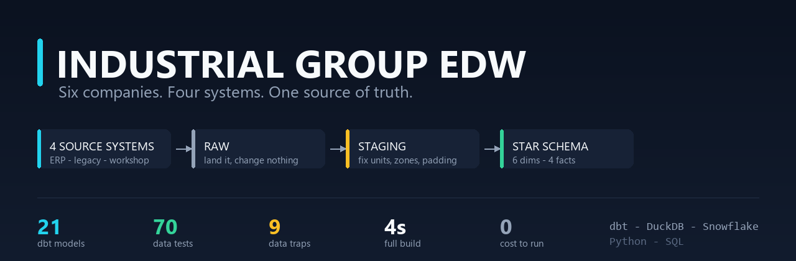
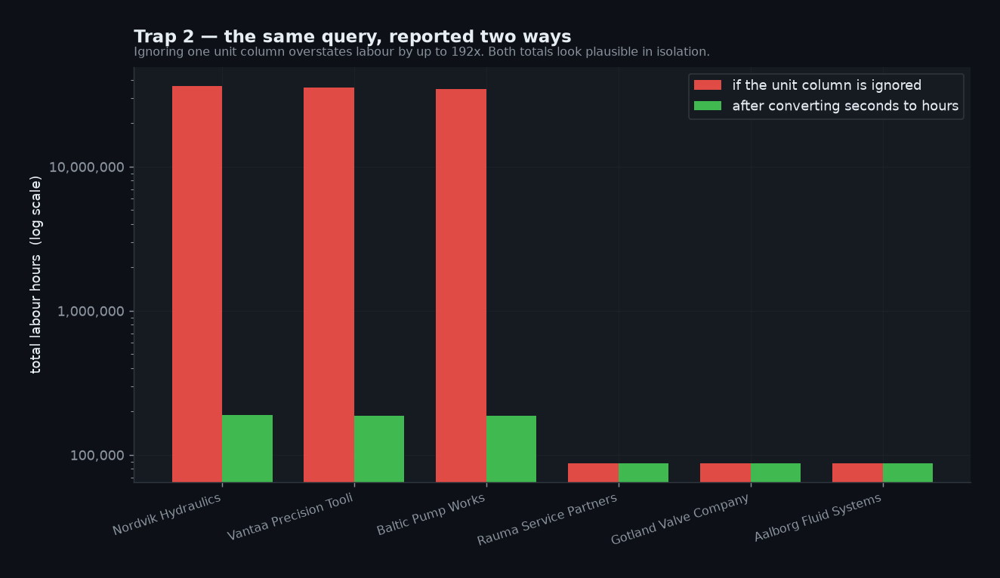
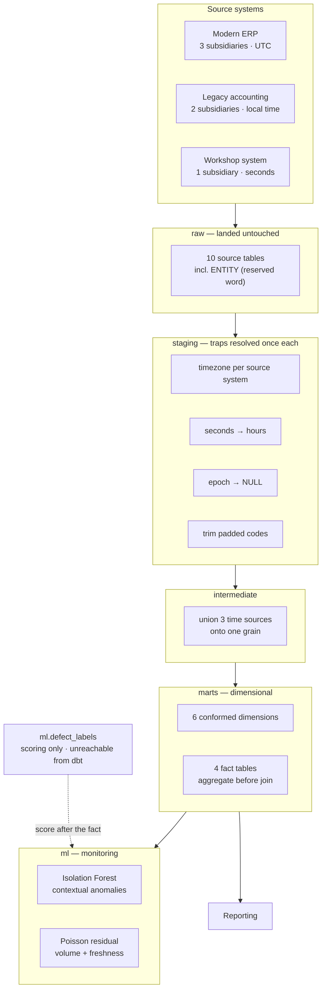
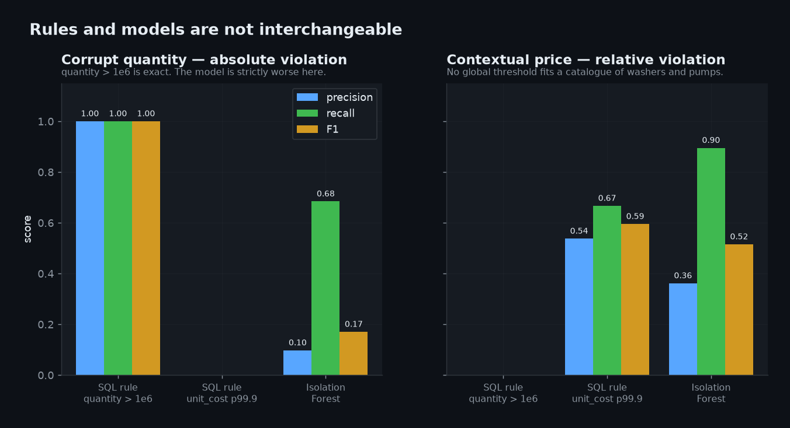
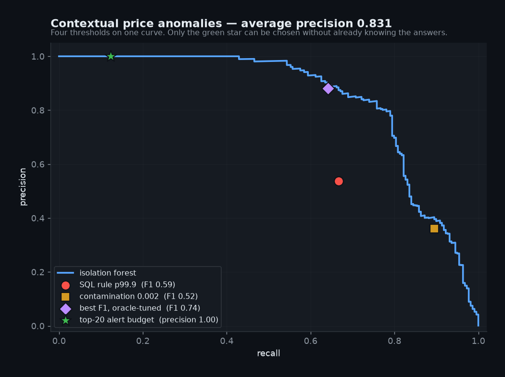
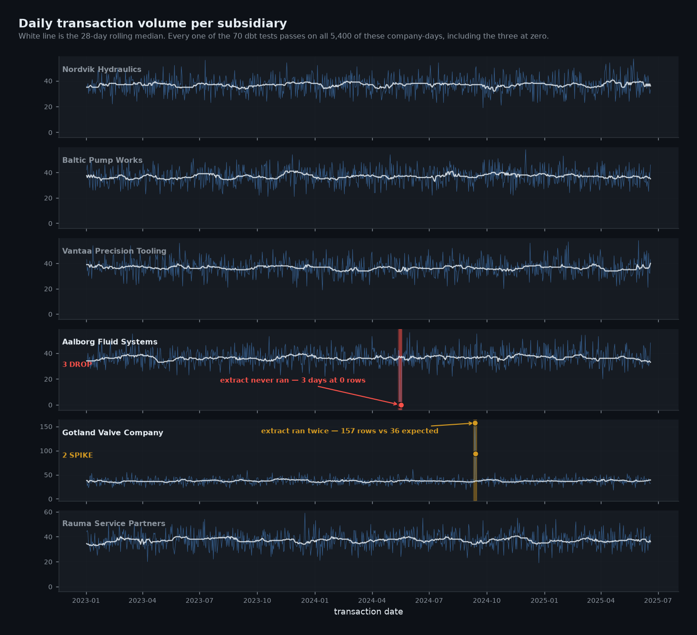

<div align="center">



### Six factories. Four incompatible ERP systems. One number nobody could trust.

A production-shaped data warehouse that consolidates them — and a machine-learning layer
that catches the two failure classes its own 70 tests structurally cannot.

<br>

[](https://docs.getdbt.com)
[](https://duckdb.org)
[](https://snowflake.com)
[](https://python.org)
[](https://scikit-learn.org)


**[Read the PDF report](docs/Industrial_Group_EDW_Report.pdf)** &nbsp;·&nbsp;
[Why this exists](docs/00-goal-and-why.md) &nbsp;·&nbsp;
[The ten traps](docs/data-traps.md) &nbsp;·&nbsp;
[ML write-up](docs/ml-anomaly-detection.md) &nbsp;·&nbsp;
[Decision log](docs/decision-log.md) &nbsp;·&nbsp;
[Run it](docs/runbook.md)

</div>


## The problem, in plain language

A manufacturing group has bought six smaller companies over twenty years. Nobody ever
consolidated the computer systems, so each subsidiary still runs the one it came with.

Every month, finance asks a single question:

> **"What did we actually spend on stock last month?"**

Answering it means combining six extracts that disagree about nearly everything — how a date
is stored, what unit a duration is in, whether a missing value is blank or `1970-01-01`, even
whether the same warehouse code means the same warehouse.

Do it by hand and you get a number. It just isn't the right number, and **nothing tells you
that.**


## Why silent failure is the whole problem

A pipeline that crashes is a good day. Somebody notices in minutes.

The expensive failures are silent: the job succeeds, the report renders, the totals look
like totals. One example from this project:

> One subsidiary books labour in **seconds**. The unit lives in a separate column that is
> easy to overlook. Add up the hours column without checking it, and group labour comes out
> **192 times too high** for the affected companies.

No error. No failing test. The number is simply wrong, and it stays wrong until somebody
senior says "that can't be right" — usually a quarter later, after decisions have been made
on it.



**Nine more traps like this are engineered into the data on purpose.** Clean synthetic data
proves nothing — anyone can model tidy inputs.


## What is actually in here

```
ingest/     synthesise six awkward source extracts + ground truth labels
   ↓
raw         land them untouched: padded text, epoch dates, reserved words intact
   ↓
staging     resolve all ten traps, once each, with the reason beside the code
   ↓
intermediate  union three incompatible time sources into one shape
   ↓
marts       6 dimensions · 4 facts · 70 tests
            (the variance fact aggregates actuals before joining, to avoid fan-out)
   ↓
ml/         contextual anomaly detection + volume monitoring
```

<details>
<summary><b>Full pipeline diagram</b></summary>



</details>


## The finding worth your time

Most portfolio projects bolt on a model and report a flattering accuracy figure. This one
does the opposite: **ML is scoped to the two problems rules genuinely cannot solve, and the
comparison is published even where the rules win.**



| | Left panel | Right panel |
|---|---|---|
| **Defect** | `CORRUPT_QUANTITY` — absolute | `CONTEXTUAL_PRICE` — relative |
| **Example** | `quantity = 256,000,000` | a washer priced like a pump |
| **SQL rule** | precision **1.000**, recall **1.000** | recall 0.667 — misses a third |
| **Isolation Forest** | 0.097 / 0.684 — much worse | avg precision **0.831** |
| **Verdict** | **Keep the rule.** No model. | **Use the model.** Nothing else works. |

The honest conclusion is not "ML wins". It is:

> **Rules for absolute violations, models for contextual ones.**
> Knowing which is which — and publishing the case where ML loses — is the actual skill.


## Why one is easy and one is impossible

```
item A-1042  (a washer)    unit_cost = 41.80    item's usual price:  4.60   ← 9× wrong
item B-7781  (a pump)      unit_cost = 41.80    item's usual price: 44.20   ← fine
```

Identical value. One is a nine-fold error, the other is a Tuesday.

No global threshold separates them, because the catalogue spans parts costing 2 and parts
costing 900. The only way to judge the row is against **that item's own history** — and
maintaining 900 hand-written thresholds is not a plan.

**Verified, not assumed:** after injecting 162 of these anomalies, **all 70 existing dbt
tests still passed.** The blind spot is real, not manufactured.


## Choosing a threshold, which is where most write-ups stop

Average precision measures how well a model *orders* rows. It says nothing about where to
cut — and the cut decides whether anyone acts on the output.



| Operating point | Precision | Recall | Usable in production? |
|---|---:|---:|---|
| Contamination 0.002 | 0.362 | 0.895 | Yes, but arbitrary — a guess |
| Best F1, oracle-tuned | 0.881 | 0.642 | **No.** Uses the labels to pick the line |
| **Top-20 alert budget** | **1.000** | 0.123 | **Yes. This is what ships.** |

**All 20 highest-scored rows were genuine anomalies. Zero false alarms.**

Recall of 0.123 looks poor until you compare it to the alternative: a report nobody reads
because two-thirds of it is noise. An alert stream that is always right earns the trust that
lets you widen the budget later. One that cries wolf gets muted in a week — and then recall
is zero.

<details>
<summary><b>The uncomfortable result I kept in the output</b></summary>

At the default threshold the forest's F1 of **0.515 is worse** than the crude rule's
**0.595**.

That is a real result and it stays visible. But read it correctly: average precision is
0.831, so the *ranking* is excellent. The problem is not the model, it is **where the line
was drawn**. On the curve above, the red SQL-rule dot sits clearly *below* the model's
curve — at matched recall the model is strictly more precise.

**Strong ordering, weak decision.** Different failures with different fixes, and conflating
them is how teams discard models that were working.

</details>


## The blind spot no row-level test can cover

All 70 tests inspect rows that **exist**. If a subsidiary's extract fails for three days:

- no test fails
- no key is null, every foreign key resolves
- the fact table reconciles **perfectly** to the source — because the source is short too
- three days of one company's stock movements are simply gone



**The detail that makes or breaks it:** a naive version groups by date and looks for low
counts. It finds *nothing* — a day with zero rows produces no group, so the absence is
invisible to a `GROUP BY`. The fix is reindexing onto a complete date × company spine and
filling gaps with explicit zeros.

**Result: 5 anomalous company-days out of 5,400. Every one genuine.**

<details>
<summary><b>Why a Poisson residual instead of a z-score</b></summary>

Daily row counts are *count* data — variance grows with the mean. A robust z-score on ~36
rows a day divides by a MAD of about 4, so an ordinary quiet Tuesday of 23 rows scores −4.7
and pages somebody.

The Pearson residual `(actual − expected) / sqrt(expected)` divides by √36 = 6, scores it
−2.3 and correctly ignores it — while a zero-row day still scores −6.1.

| Threshold | Poisson flags | Robust z flags |
|---:|---:|---:|
| 3.0 | 23 | 63 |
| 4.0 | 6 | 14 |
| **5.0** | **5** | 5 |
| 6.0 | 5 | 2 |

They agree only at 5.0, and Poisson is better on both sides: at 4.0 the z-score flags 14
days against 6 (the extras are quiet Tuesdays), and at 6.0 it has already lost three of the
five genuine incidents. That is a usable operating *range* rather than one lucky threshold.

My first version flagged twelve days, of which three were the real outage and the rest were
Tuesdays.

</details>


## The ten engineered traps

Each is one I have hit on real multi-company ERP consolidation work. Each is **silent**.

| # | Trap | What it does if you miss it |
|---:|---|---|
| 1 | Mixed time zones | Modern ERP stores UTC, legacy stores local. Converting both — or neither — corrupts every date key. |
| 2 | Mixed units in one column | Hours and seconds together. Overstates labour **192×**. |
| 3 | Sub-day grain | `line_seq` doesn't restart daily. A date-based key silently collapses distinct transactions. |
| 4 | Corrupt quantities | Cost derived as `qty × rate` explodes; the source's own amount stays correct. |
| 5 | Epoch as null | `1970-01-01` means "no date". Left alone it joins cleanly and reports 53 years early. |
| 6 | Fixed-width padded text | Untrimmed codes make one value look like two, splitting every aggregate. |
| 7 | Reserved words | A source table named `ENTITY`. Unquoted DDL fails on it. |
| 8 | Column drift | Not every subsidiary sends the same columns. |
| 9 | Genuine source duplicates | Nine rows really were extracted twice. Deduplicating hides an upstream fault. |
| 10 | **Contextual price anomalies** | Prices 2–9× the item's own median, every value individually plausible. **No rule can express this.** |

Full write-up with symptom, cause and fix for each: **[docs/data-traps.md](docs/data-traps.md)**


## Decisions worth defending

<details>
<summary><b>The fact grain carries a full timestamp, not a date</b></summary>

Transaction timestamps are unique to the second, and `line_seq` does **not** restart daily.
Truncating to a date collapses genuinely distinct transactions onto one key and the total
quietly drops.

It looks correct when you spot check it, because ~80% of rows carry `line_seq = 1`. That is
exactly what makes it dangerous. A uniqueness test on the full grain now guards it.

</details>

<details>
<summary><b>A test configured to warn, not to pass</b></summary>

Nine rows are genuine duplicates in one subsidiary's extract. Deduplicating them would hide
a real upstream fault and make the fact disagree with source on row count. So the known
baseline is encoded in the test itself:

```yaml
config:
  severity: warn
  warn_if:  ">0"    # surface it every run, so nobody forgets it exists
  error_if: ">9"    # fail the build the moment it gets worse
```

An assertion of zero would have been quietly disabled by the third person who hit it. An
assertion of *"no worse than the nine we have documented"* stays meaningful.

</details>

<details>
<summary><b>Two columns excluded from ML features, enforced by an assertion</b></summary>

`is_quantity_reliable` *is* the rule output. `amount_if_recomputed` becomes astronomic
exactly when quantity is corrupt. Include either and the model scores near-perfectly having
learned nothing — you'd ship it, the dashboard would look excellent, and the first genuinely
novel defect would sail straight through.

```python
leaked = [c for c in EXCLUDED_LEAKY if c in FEATURE_COLUMNS]
if leaked:
    raise AssertionError(f"Label leakage: {leaked} must never be used as features.")
```

A comment would be ignored by whoever adds a column to improve a score next year.

</details>

<details>
<summary><b>Median and MAD, never mean and standard deviation</b></summary>

The anomalies are *inside* the series being summarised. A mean price is dragged upward by
the very rows being hunted, so each anomaly partly conceals itself and raises the bar for
detecting the next one. A median barely moves.

For outlier detection on a series containing outliers, this isn't a refinement — it's the
only correct choice.

</details>

<details>
<summary><b>Ground truth in a schema dbt cannot reach</b></summary>

The generator knows which rows it broke. Those labels go to an `ml` schema that
`sources.yml` does not declare — so no model can reference it, even by accident. There is no
`source()` that resolves to them, so the mistake isn't available to make.

The warehouse is built without ever seeing the answers.

</details>

<details>
<summary><b>A bug that proves the traps are real</b></summary>

My first label join used `txn_timestamp` — the obvious key. It silently dropped **46% of the
labels**, making the model look far worse than it was.

The cause: staging converts timestamps to the reporting timezone for the three subsidiaries
storing UTC. That is **trap 1** — the first trap this project documents — biting my own
tooling.

A trap that catches the person who invented it is better evidence than any claim I could
make about it being realistic. The reasoning is now a comment in the generator rather than a
silent fix.

</details>

Sixteen more, plus four mistakes: **[docs/decision-log.md](docs/decision-log.md)**


## Run it

No Snowflake account, no credentials, no cloud cost. DuckDB is a local file.

```bash
git clone https://github.com/sagarkumarmishra/industrial-group-edw.git
cd industrial-group-edw

python -m venv .venv && source .venv/bin/activate    # Windows: .venv\Scripts\Activate.ps1
pip install -r requirements.txt
pip install -r requirements-ml.txt

make all
```

About 90 seconds end to end. The warehouse builds and passes all 70 tests **without** the ML
dependencies, if you only want to see the dimensional model.

| Command | Does |
|---|---|
| `make data` | generate and load source extracts |
| `make build` | transform + 70 tests |
| `make ml` | detection + volume monitoring |
| `make charts` | regenerate every figure in this README |
| `make report` | regenerate the data dictionary and PDF |
| `make snowflake` | full rebuild against Snowflake (env vars only, no secrets committed) |

Expected output, troubleshooting and verification queries:
**[docs/runbook.md](docs/runbook.md)**


## By the numbers

| | |
|---|---:|
| Source rows generated | 396,055 |
| Inventory fact rows | 200,079 |
| Models | 21 |
| dbt tests | 70 (64 generic, 6 singular) |
| Build result | PASS=90 · WARN=1 · ERROR=0 |
| Engineered data traps | 10 |
| ML features | 11 (2 excluded as leaky) |
| Rows scored | 200,070 |
| Average precision, contextual price | 0.831 |
| Top-20 alert precision | 1.000 |
| Volume anomalies found | 5 of 5,400 company-days, all genuine |

The single `WARN` is intentional — it reports the nine known source duplicates and is
configured to fail if that count ever grows. See the decision above.


## Skills this demonstrates

| Area | Evidence |
|---|---|
| Dimensional modelling | Conformed dimensions, surrogate keys, unknown members, degenerate dimensions, grain discipline |
| Data quality engineering | 70 tests including plausibility, not just structure; warn/error thresholds encoding known baselines |
| Source-system realism | Timezone, unit, epoch, padding, reserved-word and drift handling across four systems |
| dbt | 21 models across 4 layers, macros, analyses, `dbt_utils`, severity configuration |
| SQL | Engine-portable throughout; runs on DuckDB and Snowflake unchanged |
| Machine learning | Unsupervised detection, contextual feature engineering, leakage control, operating-point selection |
| Statistics | Robust estimators, Poisson residuals for count data, PR curves over ROC at low positive rates |
| Engineering judgement | Scoping ML to where it earns its place, and publishing the case where it loses |
| Communication | A 12-page report, six documents, and every figure regenerated from live output |


## What this is not

Being straight about the limits, because overclaiming is worse than a modest scope.

- **The data is real use case scenerio.** Deliberately adversarial and modelled on real patterns.
- **This run in production.** No live traffic, no rollout, no on-call. The
  engineering is real; the deployment is claimed.
- **The ML numbers are one seeded run.** Reproducible with `make all`, but not a
  cross-validated study.
- **The oracle-tuned F1 is an upper bound, not a result.** It uses the labels to pick its
  threshold. Labelled as such everywhere it appears.
- **No SCD2, no incremental models, no orchestration.** Full rebuilds are instant at 200k
  rows and unacceptable at 200m. The keys for incrementality exist and are unused — a
  deliberate scope decision, documented in
  [architecture.md](docs/architecture.md#what-is-deliberately-not-here).


<div align="center">

**[Read the full PDF report →](docs/Industrial_Group_EDW_Report.pdf)**

Built by **Sagar Kumar Mishra** · [MIT licensed](LICENSE)


</div>
