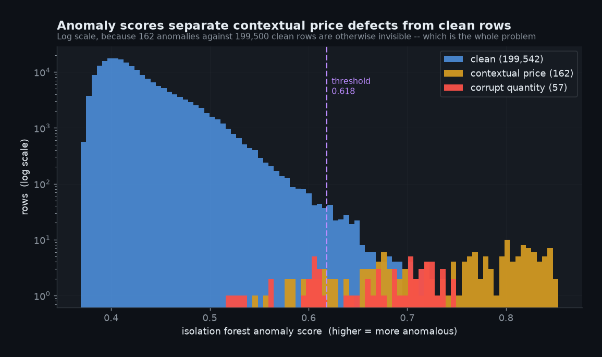

# Anomaly detection: where machine learning earns its place, and where it does not

Every number on this page comes from one seeded run of `make ml`. Reproduce it and you get
the same figures.

---

## 1. The question worth asking

Not *"can I train a model on warehouse data"* — of course you can. The useful question is:

> **Given a defect, is a model better than a `WHERE` clause? And can I prove it either
> way?**

This project answers that for two defect classes, and the answers point in opposite
directions. That opposition is the entire finding.

| Defect class | Nature | Verdict |
|---|---|---|
| `CORRUPT_QUANTITY` | absolute — wrong on sight | **Rule wins decisively.** Do not deploy a model. |
| `CONTEXTUAL_PRICE` | relative — wrong only for that item | **Model wins.** No threshold can express it. |

---

## 2. Why one is easy and one is not

### Absolute violations

```
quantity = 256,000,000
```

A quantity of 256 million on an inventory line is nonsense regardless of context. One line
of SQL catches every instance:

```sql
case when quantity > 1000000 then 0 else 1 end as is_quantity_reliable
```

This is already in the warehouse, in `stg_inventory_cost_txn`. It is exact, free, needs no
training, and never drifts.

### Contextual violations

```
item A-1042 (a washer)     unit_cost = 41.80     item's usual price:  4.60
item B-7781 (a pump)       unit_cost = 41.80     item's usual price: 44.20
```

Identical value. The first is a nine-fold error; the second is a Tuesday.

There is no global threshold that separates them, because the catalogue spans parts costing
2 and parts costing 900. Any single number either misses cheap-item anomalies or drowns in
expensive-item false positives. The only way to judge the row is **against that item's own
price history** — and maintaining 900 per-item thresholds by hand is not a plan.

This is precisely the shape of problem a model handles well and a rule cannot.

---

## 3. Features: mostly a story about exclusions

### The leakage trap

The fact table carries two columns that encode the answer:

| Column | Why it leaks |
|---|---|
| `is_quantity_reliable` | *is* the rule output — `quantity > 1e6`, already computed |
| `amount_if_recomputed` | becomes astronomic exactly when quantity is corrupt |

Include either and the model scores near-perfectly on corrupt quantities while having
learned nothing whatsoever. You would ship it, the dashboard would look excellent, and the
first genuinely novel defect would sail straight through.

This is the single most common way ML pipelines produce impressive, worthless numbers. Both
columns are excluded, and the exclusion is enforced in code rather than trusted to
discipline:

```python
EXCLUDED_LEAKY = ["is_quantity_reliable", "amount_if_recomputed"]

leaked = [c for c in EXCLUDED_LEAKY if c in FEATURE_COLUMNS]
if leaked:
    raise AssertionError(f"Label leakage: {leaked} must never be used as features.")
```

If somebody adds one back in six months, the build fails loudly instead of quietly
producing a flawless score.

### The eleven features

| Feature | Type | Why it is there |
|---|---|---|
| `unit_cost_z_by_item` | contextual | robust z-score of price *within the item* — the workhorse |
| `unit_cost_ratio_to_item` | contextual | price ÷ item's median price; interpretable, survives zero-MAD items |
| `quantity_z_by_item` | contextual | same idea for quantity |
| `amount_z_by_item` | contextual | catches amount anomalies that price alone misses |
| `amount_per_unit` | derived | independent check on internal consistency |
| `quantity`, `unit_cost`, `transaction_amount` | absolute | raw magnitudes; carry the corrupt-quantity signal |
| `hour_of_day` | temporal | out-of-hours postings are weakly informative |
| `is_wip` | categorical | work-in-progress lines behave differently |
| `item_txn_count` | meta | lets the model discount thinly-traded items |

### Why robust statistics, not mean and standard deviation

The anomalies are **inside the data being summarised**. A mean price is dragged upward by
the very rows we are hunting, so each anomaly partially conceals itself and raises the bar
for detecting the next one. A median barely moves.

```python
def _robust_z(values):
    med = values.median()
    mad = (values - med).abs().median()
    if mad == 0 or np.isnan(mad):
        return pd.Series(np.zeros(len(values)), index=values.index)
    return (values - med) / (1.4826 * mad)     # 1.4826 rescales MAD to sigma
```

For outlier detection on a series containing outliers, this is not a refinement — it is the
only correct choice.

### Why thin items are deliberately given a score of zero

Items seen fewer than 20 times keep `z = 0`. With a handful of observations there is no
reliable notion of "normal for this item", and inventing one generates false positives on
rare parts. That is how monitoring loses the trust of the people who have to action the
alerts, after which it may as well not exist.

---

## 4. Model choice

**Isolation Forest**, 300 estimators, `max_samples=4096`, seeded.

Unsupervised, which is the point: in production nobody has told you which rows are wrong.
The ground truth here exists **only to score the result afterwards** — the model never sees
it. That is what makes the approach transferable to a real platform rather than a
demonstration that only works because the answers were available.

| Alternative | Why not |
|---|---|
| Supervised classifier | Would score better here and be useless in production — it needs the labels you are trying to produce. |
| Local Outlier Factor | Comparable quality, far slower at 200k rows, no measurable gain on this data. |
| Autoencoder | Defensible at much larger scale. At 200k rows and 11 features it is a heavier dependency and a slower loop for results within noise of the forest. |

Trees split on ordering, so no feature scaling is applied. A `StandardScaler` here would be
harmless and pointless.

---

## 5. Results

200,070 rows scored. 11 features. Contamination 0.002 → 401 rows flagged.

### Corrupt quantity — 57 rows in ground truth

| Detector | Precision | Recall | F1 |
|---|---:|---:|---:|
| **SQL rule** `quantity > 1e6` | **1.000** | **1.000** | **1.000** |
| SQL rule `unit_cost` p99.9 | 0.000 | 0.000 | 0.000 |
| Isolation Forest | 0.097 | 0.684 | 0.170 |

The rule is perfect. The forest is far worse — it spends its limited flag budget across
both defect classes and misses 18 of 57. **Correct engineering decision: keep the rule, do
not deploy a model for this class.**

### Contextual price — 162 rows in ground truth

| Detector | Precision | Recall | F1 |
|---|---:|---:|---:|
| SQL rule `quantity > 1e6` | 0.000 | 0.000 | 0.000 |
| SQL rule `unit_cost` p99.9 | 0.537 | 0.667 | **0.595** |
| Isolation Forest | 0.362 | **0.895** | 0.515 |
| Isolation Forest — **average precision** | | | **0.831** |



---

## 6. The uncomfortable result, reported rather than buried

**At the default threshold the forest's F1 of 0.515 is *worse* than the crude rule's
0.595.**

That is a real result and it stays in the output. But read it correctly: the forest's
average precision is **0.831**, meaning its *ranking* is excellent. The problem is not the
model, it is **where the line was drawn**.


The red dot is the SQL rule. It sits clearly **below** the curve — so at matched recall the
model is strictly more precise. The rule only wins on F1 because contamination 0.002 put
the forest at a badly chosen point on a curve it otherwise dominates.

**Strong ordering, weak decision.** Those are different failures with different fixes, and
conflating them is how teams discard models that were working.

---

## 7. Choosing a threshold, which is where most write-ups stop

Average precision measures how well the model *orders* rows. It says nothing about where to
cut, and the cut is what determines whether anyone acts on the output.

| Operating point | Precision | Recall | F1 | Usable in production? |
|---|---:|---:|---:|---|
| Contamination 0.002 | 0.362 | 0.895 | 0.515 | Yes, but arbitrary — a guess made before seeing results |
| Best F1, oracle-tuned | 0.881 | 0.642 | 0.743 | **No.** Uses the labels to pick the line |
| **Top-20 alert budget** | **1.000** | 0.123 | 0.220 | **Yes. This is what ships.** |

### On the oracle-tuned row

It is an upper bound and nothing more. If you have the labels you do not need the detector.
It is reported because knowing the ceiling is useful, and labelled at every appearance
because quoting it as achievable performance would be dishonest.

### On the alert budget

This is the operating point a real platform uses, and it needs no labels at all. A human
can meaningfully triage roughly 20 rows a day, so take the top 20 by score and accept
whatever recall that buys.

**All 20 were genuine anomalies. Precision 1.000, zero false alarms.**

Recall of 0.123 sounds poor until you compare it to the alternative, which is a report
nobody reads because two-thirds of it is noise. An alert stream that is always right builds
the trust that lets you widen the budget later. One that cries wolf gets muted in a week,
and then recall is zero.

---

## 8. Volume monitoring: the blind spot no row-level test can cover

All 70 dbt tests inspect rows that **exist**. If a subsidiary's extract fails for three
days:

- no test fails
- no key is null, no uniqueness is violated, every foreign key resolves
- the fact table reconciles **perfectly** to the source, because the source is short too
- three days of one company's stock movements are simply gone


### The detail that makes or breaks it

A naive implementation groups by date and company and looks for low counts. **It finds
nothing.** A day with zero rows produces no group — the absence is invisible to a
`GROUP BY`.

```python
# Reindex onto a complete date x company spine, then fill gaps with zero.
spine = companies.merge(pd.DataFrame({"txn_date": all_dates}), how="cross")
full = spine.merge(counts, on=["company_key", "company_name", "txn_date"], how="left")
full["row_count"] = full["row_count"].fillna(0).astype(int)
```

That single step is the difference between a monitor that works and one that reports
all-clear through a total outage.

### Why a Poisson residual, not a z-score

Two separate decisions, and conflating them is the usual mistake.

The **baseline** is a rolling median, for the robustness reason above. The **test
statistic** is a Pearson residual:

```
residual = (actual − expected) / sqrt(expected)
```

Daily row counts are *count* data, roughly Poisson: variance grows with the mean, so the
spread is already determined by the expected value and does not need estimating separately.

This matters in practice. A robust z-score on ~36 rows a day divides by a MAD of about 4,
so an ordinary quiet Tuesday of 23 rows scores −4.7 and pages somebody. The Poisson
residual divides by √36 = 6, scores it −2.3, and correctly ignores it — while a zero-row
day still scores −6.1 and a spike scores +19.9.

I arrived at that the way everyone does: the first version flagged 12 days, of which 3 were
the real outage and the rest were Tuesdays.

### Threshold sensitivity

| Threshold | Poisson residual flags | Robust z-score flags |
|---:|---:|---:|
| 3.0 | 23 | 63 |
| 4.0 | 6 | 14 |
| **5.0** | **5** | 5 |
| 6.0 | 5 | 2 |

The two agree only at 5.0, and the Poisson residual is better on both sides of it. Loosen
to 4.0 and the z-score flags 14 days against 6, the extras being quiet Tuesdays. Tighten to
6.0 and the z-score has **already lost three of the five genuine incidents**.

So this is not a marginal accuracy gain — it is a usable operating *range* instead of one
lucky threshold. That matters because a smaller subsidiary's outage would score below 5.0,
and you want room to lower the bar without drowning.

### Result

**5 anomalous company-days out of 5,400 checked. Every one genuine.**

| Date | Company | Actual | Expected | Poisson | Verdict |
|---|---|---:|---:|---:|---|
| 2024-05-15 | Aalborg Fluid Systems | 0 | 38 | −6.1 | DROP |
| 2024-05-16 | Aalborg Fluid Systems | 0 | 36 | −6.0 | DROP |
| 2024-05-17 | Aalborg Fluid Systems | 0 | 36 | −6.0 | DROP |
| 2024-09-12 | Gotland Valve Company | 157 | 36 | +19.9 | SPIKE |
| 2024-09-13 | Gotland Valve Company | 94 | 37 | +9.4 | SPIKE |

Precision 1.000, recall 1.000, no false positives.

The spike is not a data defect — the rows are valid. But six times normal volume in a day
almost always means a job ran twice, and that is worth catching before it becomes
double-counted cost.

---

## 9. Ground truth: how scoring stays honest

The generator decides which rows to break, so it knows the answers. They are written to a
separate file and loaded into an `ml` schema that **`sources.yml` does not declare** — so no
dbt model can reference it, even accidentally.

```
data/labels/defect_labels.parquet  →  ml.defect_labels
```

The warehouse is built without ever seeing which rows are defective. On a real platform
this schema is where your confirmed incident log lives.

| Defect type | Rows | Caught by |
|---|---:|---|
| `EPOCH_DATE` | 300 | dbt test (deterministic) |
| `CONTEXTUAL_PRICE` | 162 | **Isolation Forest** |
| `CORRUPT_QUANTITY` | 57 | SQL rule |
| `SOURCE_DUPLICATE` | 9 | dbt test (deterministic) |
| **Total** | **528** | |

### A bug worth documenting

My first label join used `txn_timestamp` — the obvious key. It silently dropped **46% of
the labels**, and the model looked far worse than it was.

The cause: staging converts timestamps to the reporting timezone for the three subsidiaries
whose systems store UTC. That is **trap 1**, the first data trap this project is about,
biting my own tooling. The raw timestamp the generator recorded no longer equalled the
value in the fact table for half the group.

The fix was to key on business columns plus the measures, which pass through staging
unchanged:

```python
LABEL_JOIN = ["company_key", "item_code", "warehouse_code",
              "cost_component_code", "line_seq", "quantity", "unit_cost"]
```

I have left the reasoning in a comment in `ingest/generate.py`, because a trap that catches
the person who invented it is the best possible evidence that it is a real trap.

---

## 10. Honest limitations

- **One seeded run.** Reproducible, but not a cross-validated study. No confidence
  intervals are claimed.
- **Synthetic anomalies.** Injected at 2–9× an item's median with per-item volatility of
  3–35%, which creates genuine overlap — clean rows reach 2.34× while anomalies start at
  2.0×. Real contextual anomalies are messier still.
- **The centred rolling window is a backtest convenience.** A monitor scoring *today*
  cannot see the future and must use a trailing window, which performs slightly worse.
  Noted because this is exactly how backtests come to flatter the live system they predict.
- **No drift handling.** A production deployment needs periodic refitting and a check on
  whether the score distribution has moved.
- **Duplicate recall is slightly understated.** The nine known source duplicates share
  every column by definition, so the label join can match more than one row; duplicates are
  dropped afterwards.

---

## 11. Reproducing this

```bash
make ml        # generate, load, build, score, monitor
make charts    # regenerate every figure on this page
```

| File | Role |
|---|---|
| `ml/features.py` | feature engineering, leakage controls |
| `ml/detect_anomalies.py` | Isolation Forest, rule baselines, operating points |
| `ml/volume_monitor.py` | time-series volume and freshness monitoring |
| `ml/charts.py` | every figure, generated from live outputs |
| `data/ml/metrics.json` | machine-readable results |
